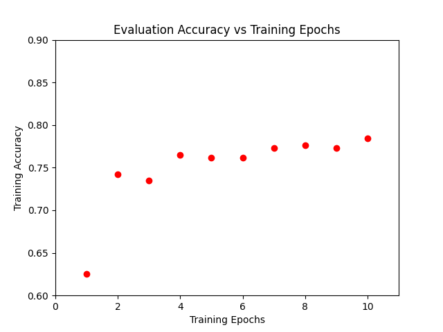

# Machine Learning

*These are my personal notes on machine learning. These notes are collected from multiple trainings and tutorials as noted in the [References](#references) section*

Machine Learning is the use and development of computer systems and models that are able to learn and adapt without following explicit instructions, by using algorithms and statistical models to analyze and infer from patterns of data. 

## TOC

 - [Tech Stack](#tech-stack)
 - [TensorFlow](#tensorflow)
 - [Machine Learning Algorithms](#machine-learning-algorithms)
    - [Linear Regression](#linear-regression)
    - [Classification]()
    - [Clustering]()
    - [Hidden Markov Models]()
 - [References](#references)


## Tech Stack
Packages Used:
 - TensorFlow `pip install tensorflow`
 - pandas `pip install pandas`
 - matplotlib `pip install matplotlib`
 - numpy `pip install numpy`


## TensorFlow
TensorFlow is a FOSS library for Machine Learning and AI with a focus on training and inference of Deep Neural Networks(DNN). It was developed by the Google Brain Team. 

https://www.tensorflow.org/

### Tensors

A tensor is a generalization of vectors and matrices to potentially higher dimensions. Internally, TensorFlow represents tensors as n-dimensional arrays of base datatypes."

**Types of Tensors**
 - Variable
 - Constant
 - Placeholder
 - SparseTensor

 With the exception of `Variable` all of these tensors are immutable.

#### Creating Tensors

```python
string = tf.Variable("this is a string", tf.string)
number = tf.Variable(324, tf.int16)
floating = tf.Variable(3.567, tf.float64)
```

#### Rank/Degree of Tensors

Ranks or Degree is the number of embedded arrays in a tensor. The above example are *Rank 0* as it is not an array (list) and can only hold a single value.

```python
rank1_tensor = tf.Variable(['This', 'is', 'a', 'rank', '1', 'tensor'], tf.string)
rank2_tensor = tf.Variable([['This', 'is', 'a'], ['rank', '2', 'tensor']], tf.string)
```

Determining the Rank of a Tensor:
```python
>>> tf.rank(rank2_tensor)
<tf.Tensor: shape=(), dtype=int32, numpy=2>
```

#### Tensor Shape

The shape of a tensor is the amount of elements that exist in each dimension.

```python
>>> rank2_tensor.shape
TensorShape([2, 3])
```

#### Changing Shape

The number of elements of a tensor is the product of the sizes of all its shapes. There are often many shapes that have the same number of elements making it convenient to be able to change the shape of a tensor.

```python
>>> tensor1 = tf.ones([1,2,3]) # Creates a tensor with 1 list, consisting of 2 lists with 3 elements each - 6 elements total
>>> print(tensor1)
tf.Tensor(
[[[1. 1. 1.]
  [1. 1. 1.]]], shape=(1, 2, 3), dtype=float32)

>>> tensor2 = tf.reshape(tensor1, [2,3,1]) # Reshape Tensor to 2 lists, consisting of 3 lists each, each containing 1 element - 6 elements total
>>> print(tensor2)
tf.Tensor(
[[[1.]
  [1.]
  [1.]]

 [[1.]
  [1.]
  [1.]]], shape=(2, 3, 1), dtype=float32)

>>> tensor3 = tf.reshape(tensor2, [3, -1]) # A value of -1 tells tensor flow to calculate that value to ensure the tensor is reshaped accordingly
>>> print(tensor3)
tf.Tensor(
[[1. 1.]
 [1. 1.]
 [1. 1.]], shape=(3, 2), dtype=float32)
```

## Machine Learning Algorithms

 - Linear Regression
 - Classification
 - Clustering
 - Hidden Markov Models

### Linear Regression

[Example Script](linear_regression.py)


Linear Regression is one of the most basic machine learning algorithms and is used to predict numeric values.

Linear Regression Function: `y = mx + b`

Linear Regression calculates the line of best fit for a dataset. 

Given the following plot:


with points at (1,1), (2,4), (2.5,7), (3,9), and (4,15)

The calculated line of best fit would be:


The line of best fit has the equation: `y = 4.7x - 4.55`

*Graphs Generated with matplotlib*
<details>
    <summary>View Code</summary>

```python
import matplotlib.pyplot as plt
import numpy as np

# Sample Dataset
x = [1, 2, 2.5, 3, 4]
y = [1, 4, 7, 9, 15]

# Plot Sample Dataset
plt.plot(x,y, 'ro')
plt.axis([0, 6, 0, 20])

# Calculate and Plot Line of Best Fit
plt.plot(np.unique(x), np.poly1d(np.polyfit(x, y, 1))(np.unique(x)))

plt.show()

# Finding Values of m and b =? [ m b ]
f = np.polyfit(x, y, 1)
print(f)
```
</details>

#### Data

ML algorithms require data to train and evaluate models. Data can come in many different forms. 

Machine learning algorithms require seperate training and evaluation data to ensure the algorithm hasn't just memorized the training data.

The dataset used for [linear_regression.py](/linear_regression.py) is a sample dataset of titanic survivors from TensorFlow. 
<br>

Training Data: https://storage.googleapis.com/tf-datasets/titanic/train.csv
<br>
Evaluation Data: https://storage.googleapis.com/tf-datasets/titanic/eval.csv

**Training Data Graphs**


<details>
    <summary>Graph Code</summary>

```python
dftrain.age.plot.hist(bins=20)
plt.title('Passengers by age')
plt.xlabel('Age')
plt.show()
```
</details>


<details>
    <summary>Graph Code</summary>

```python
dftrain.sex.value_counts().plot(kind='barh')
plt.title('Passengers by Sex')
plt.show()
```
</details>


<details>
    <summary>Graph Code</summary>

```python
dftrain['class'].value_counts().plot(kind='barh')
plt.title('Passengers by Class')
plt.show()
```
</details>


<details>
    <summary>Graph Code</summary>

```python
pd.concat([dftrain, y_train], axis=1).groupby('sex').survived.mean().plot(kind='barh').set_xlabel('% survived')
plt.title('Titanic Survivors by Sex')
plt.show()
```
</details>

**Catagorical vs Feature Data**
Catagorical data is data that is not numeric. It will need to be converted to numeric data before it can be used

Processing Catagorical and Feature Columns:
```python
CATEGORICAL_COLUMNS = ['sex', 'n_siblings_spouses', 'parch', 'class', 'deck', 'embark_town', 'alone']

NUMERIC_COLUMNS = ['age', 'fare']

feature_columns = []
for feature_name in CATEGORICAL_COLUMNS:
    vocabulary = dftrain[feature_name].unique() # Pulls a list of each unique value in a column
    feature_columns.append(tf.feature_column.categorical_column_with_vocabulary_list(feature_name, vocabulary))

for feature_name in NUMERIC_COLUMNS:
    feature_columns.append(tf.feature_column.numeric_column(feature_name, dtype=tf.float32))
```

#### Training Process

In linear_regression.py training data is streamed in *batchs* of 32 datasets for a number of *epochs*. An *epoch* is the number of times the model will see the complete dataset. 

Loading data in batches is usefull for very large datasets that can't all be loaded into memory. 

**Over Fitting**<br>
It is possible to feed the data to many times to a model. The model then *memorizes* the dataset and is really good at predicting the training data, but fails with the evaluation data. Preventing this is done by starting with a low number of epochs and slowly increasing to tune the best results.




Converting data into batchs and feeding it to the training model is done through an *input function*

This TensorFlow model requires data be passed as a td.data.Dataset object. The input function converts the pandas dataframe object into a td.data.Dataset object. 

```python
def make_input_fn(data_df, label_df, num_epochs=10, shuffle=True, batch_size=32):
    def input_function(): # Function returned by input function
        ds = tf.data.Dataset.from_tensor_slices((dict(data_df), label_df)) # Create tf.data.Dataset object from the pandas data and labels
        if shuffle:
            ds = ds.shuffle(1000) # Randomize the order of the data
        ds = ds.batch(batch_size).repeat(num_epochs) # Split the dataset into batches of size batch_size and repeat process for the number of epochs
        return ds
    return input_function
```

make_input_fn passes an inner function that can then be called by the model to process the initial data. (Think Lambda Functions)

#### Creating the Model

TensorFlow uses *estimators* to create the ML models.

```python
linear_est = tf.estimator.LinearClassifier(feature_columns=feature_columns)
```
The above code creates an estimator that will use a LinearClassifier from the feature_columns that are passed to it.

#### Training and Evaluating the Model

Passing the estimator model the training data in *train* mode will train the data
```python
linear_est.train(train_input_fn)
```

Passing the estimator model the eval data in *evaluate* mode will evaluate the data and return metrics / stats for the model
```python
result = linear_est.evaluate(eval_input_fn)
```
Evaluating a model returns a dictionary.

##### Predicting results
models have a predict method that will return..... a prediction. in the case of linear_regression.py the model will predect weather the passenger survived or died.

```python
result = list(linear_est.predict(eval_input_fn)) # Convert to list to parse the results
```

the prediction can be accessed through the `probabilities` dictionary object. `probabilities` returns an array with the calculated propabilities of the results. In the case of linear_regression.py the array is [died, survived] so returning `result[0]['probabilities'][1]` would return the probability that the passenger at index 0 survived. 
## Classification


## Clustering

## Hidden Markov Models

## References

- [freeCodeCamp](https://www.freecodecamp.org/learn/machine-learning-with-python/)
- [TensorFlow Tutorials](https://www.tensorflow.org/tutorials)